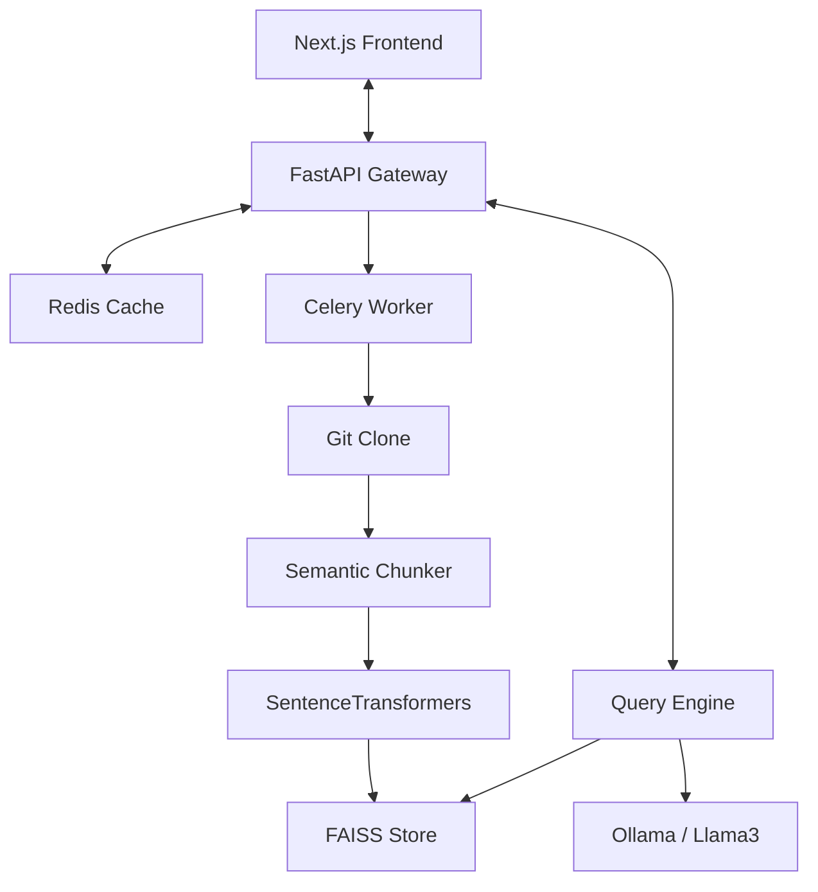

# 🤖 RepoAnalyzer: AI Code Intelligence Platform

[](https://fastapi.tiangolo.com)
[](https://nextjs.org)
[](https://www.docker.com)
[](LICENSE)

**RepoAnalyzer** is a production-grade AI code intelligence platform designed for senior engineering teams. It ingests large repositories, indexes them with semantic vector embeddings, and provides a high-performance streaming chat interface for deep codebase analysis.

---

## ⚡ Key Engineering Features

### 🚀 High-Performance RAG v2
Our retrieval pipeline isn't just a simple search. It uses senior-level optimization techniques:
- **MMR (Max Marginal Relevance)**: Diversifies context by penalizing redundant code chunks, ensuring the LLM sees a broader view of the codebase.
- **Query Rewriting**: Automatically expands technical shorthand (e.g., "auth" → "authentication authorization") to improve embedding recall.
- **SSE Streaming**: Token-by-token server-sent events for a real-time, ChatGPT-like interface.

### 💾 Scalability & Performance
- **Redis Answer Caching**: Identical queries return in sub-milliseconds from a global cache.
- **FAISS Vector Search**: Industry-standard vector storage for lightning-fast semantic retrieval.
- **Celery Task Queue**: Robust asynchronous ingestion flow for handling large repositories without blocking the API.

---

## 🛠 Tech Stack

| Component | Technology |
| :--- | :--- |
| **Backend** | Python 3.10+, FastAPI, Pydantic v2 |
| **Frontend** | React 19, Next.js 15+ (App Router), Tailwind CSS v4 |
| **Vector Store** | FAISS |
| **Embeddings** | SentenceTransformers (all-MiniLM-L6-v2) |
| **LLM Adapter** | Ollama (Llama 3) |
| **Caching** | Redis |
| **Database** | PostgreSQL (Metadata Tracking) |

---

## 🗺 System Architecture



---

## 🏁 Getting Started

### Prerequisites
- Docker & Docker Compose
- [Ollama](https://ollama.com/) running locally (for LLM inference)

### Option 1: Docker (Recommended)
This is the fastest way to get the full production environment running:
```bash
docker-compose up --build
```
- **UI**: [http://localhost:3000](http://localhost:3000)
- **API Docs**: [http://localhost:8000/docs](http://localhost:8000/docs)

### Option 2: Local Development
**Backend Setup:**
```bash
cd backend
python -m venv .venv
source .venv/bin/activate
pip install -r requirements.txt
python main.py
```

**Frontend Setup:**
```bash
cd frontend
npm install
npm run dev
```

---

## 🧪 Testing & Reliability
We maintain a **35+ test suite** covering Unit and Integration layers.
```bash
cd backend
pytest tests/ -v
```

---

## 📜 License
Internal use only. See LICENSE for details.

---
Developed with ❤️ by the Mustakim Shaikh.